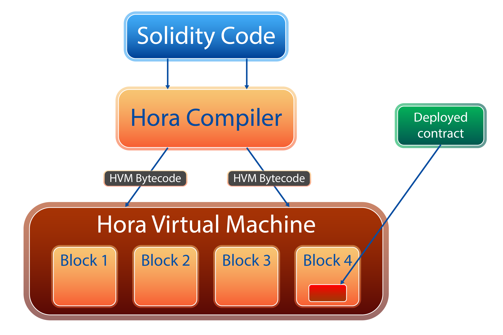

# Hora Virtual Machine

The Hora Virtual Machine \(HVM\) is an Ethereum Virtual Machine integrated into the Hora Os platform. HVM is a virtual machine system that runs to validate the state of the Ethereum blockchain network, it belongs to layer1 that allows interaction and authentication of data without going through the main chain. At the same time, it is possible to interact with the main chain through smartcontracts to overwrite the data on the block and validate the data on the blocks through the minified hash function.

