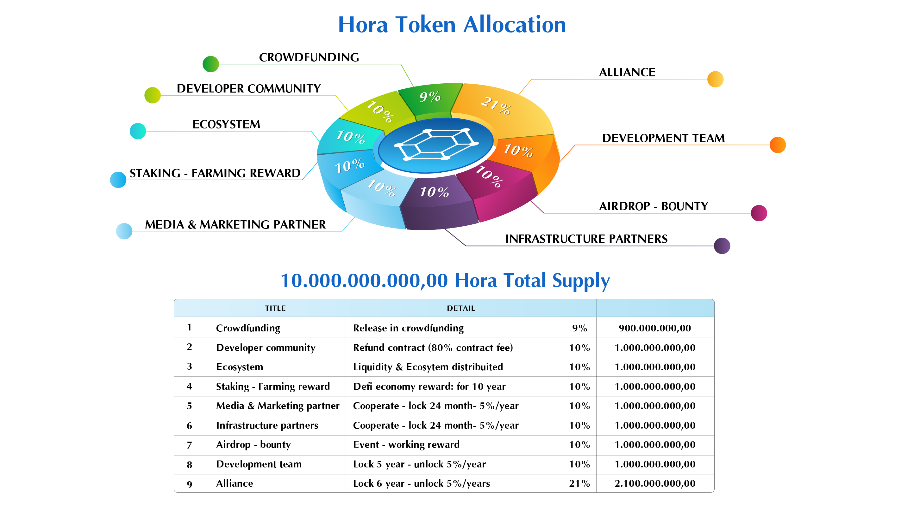

# Tokenomics

#### Information

| Title | Detail |
| :--- | :--- |
| Function | **Governance- Unity token** |
| Fullname | Hora Os |
| Symbol | HORA |
| Network | Binance Smartchain |
| Scan | [Smarchain](https://bscscan.com/token/0xa6fd7b5c9eee30309b00b65436a284e2053251e5) |
| Information | [https://token.horaos.com/](https://token.horaos.com/) |

#### Token Allocation

#### Validate Reward



