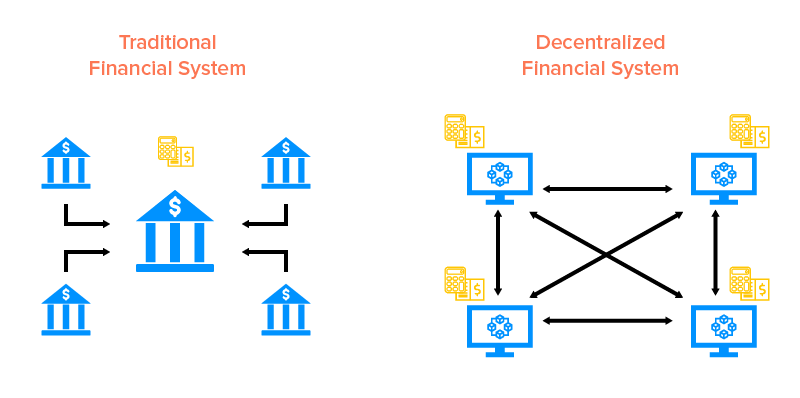

# Decentralize Finance \(Defi\)

**Decentralized finance** \(commonly referred to as **DeFi**\) is a [blockchain](https://en.wikipedia.org/wiki/Blockchain)-based form of finance that does not rely on central financial [intermediaries](https://en.wikipedia.org/wiki/Intermediary) such as [brokerages](https://en.wikipedia.org/wiki/Brokerage), [exchanges](https://en.wikipedia.org/wiki/Exchange_%28organized_market%29), or [banks](https://en.wikipedia.org/wiki/Bank) to offer traditional [financial instruments](https://en.wikipedia.org/wiki/Financial_instrument), and instead utilizes [smart contracts](https://en.wikipedia.org/wiki/Smart_contract) on blockchains, the most common being [Ethereum](https://en.wikipedia.org/wiki/Ethereum).[\[1\]](https://en.wikipedia.org/wiki/Decentralized_finance#cite_note-Financial_Times_2019-12-30-1) DeFi platforms allow people to lend or borrow funds from others, speculate on price movements on a range of assets using derivatives, trade [cryptocurrencies](https://en.wikipedia.org/wiki/Cryptocurrencies), insure against risks, and earn [interest](https://en.wikipedia.org/wiki/Interest) in savings-like accounts.[\[2\]](https://en.wikipedia.org/wiki/Decentralized_finance#cite_note-Bloomberg_2020-08-26-2) DeFi uses a layered architecture and highly composable building blocks.[\[3\]](https://en.wikipedia.org/wiki/Decentralized_finance#cite_note-3) Some DeFi applications promote high [interest rates](https://en.wikipedia.org/wiki/Interest_rate)[\[2\]](https://en.wikipedia.org/wiki/Decentralized_finance#cite_note-Bloomberg_2020-08-26-2) but are subject to high risk.[\[1\]](https://en.wikipedia.org/wiki/Decentralized_finance#cite_note-Financial_Times_2019-12-30-1) By October 2020, over $11 billion \(worth in cryptocurrency\) was deposited in various decentralized finance protocols, which represented more than a tenfold growth during the course of 2020.[\[4\]](https://en.wikipedia.org/wiki/Decentralized_finance#cite_note-4)[\[2\]](https://en.wikipedia.org/wiki/Decentralized_finance#cite_note-Bloomberg_2020-08-26-2) As of January 2021, approximately $20.5 billion was invested in DeFi.[\[5\]](https://en.wikipedia.org/wiki/Decentralized_finance#cite_note-5)

[https://en.wikipedia.org/wiki/Decentralized\_finance](https://en.wikipedia.org/wiki/Decentralized_finance)

