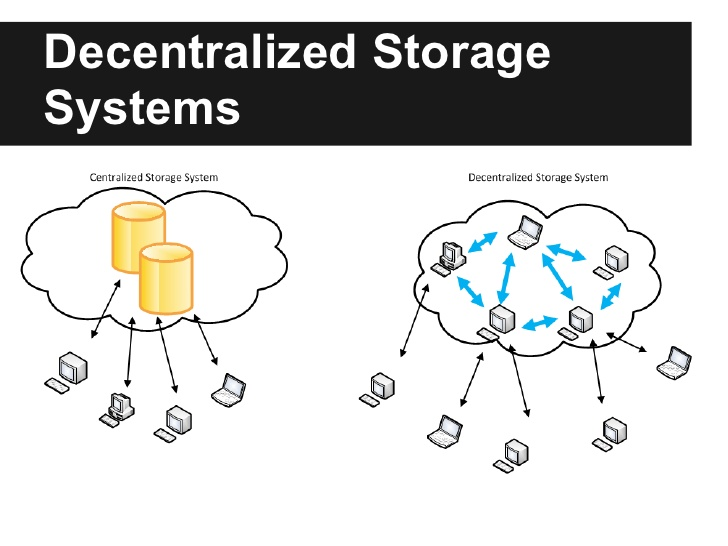

# Storage Decentralized

Several platforms offer decentralized storage networks with no central storage or monitoring facility. The data is stored across multiple locations, with the servers hosted by independent operators rather than large entities. Individuals or businesses can participate and rent out the unused storage space on their computers. Some platforms operate on their own independent blockchains, while others run on open public blockchains. This means that the function and operation of the platforms and their services can vary. Participants are usually incentivized using the native token of the platform, which is used to pay for and reward transactions.

