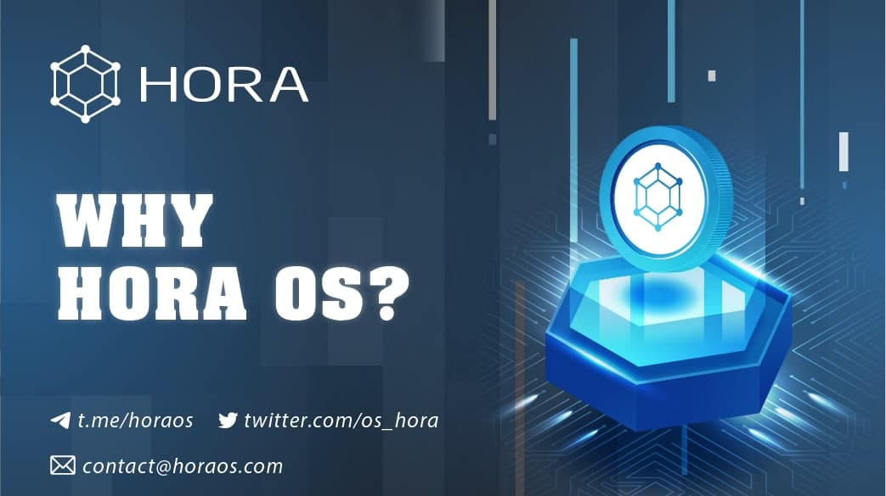

# Why Hora OS

1. **Sustainable:** based on a model that works through a network of computers, it does not depend on any computer. 
2. **High security:** Encrypted and distributed data according to a decentralized mechanism 
3. **Energy-saving:**tokenization of computer network resources leads to better usage efficiency 
4. **Infinitely scalable:** the mechanism to connect millions of computers to the network 
5. **Optimal network operating costs:** based on the sharing economy model \(peer-to-peer - P2P\)

